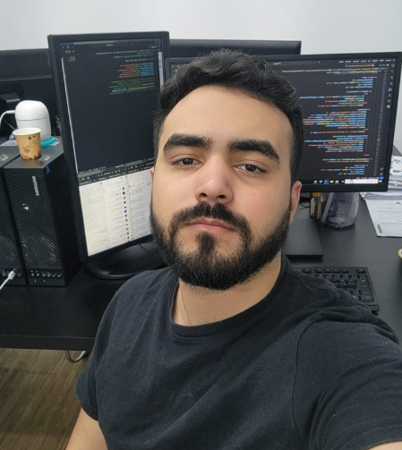

---
hide:
  - navigation
  - toc
  - path
---

# Estamos transformando dados em decisões na saúde pública da cidade do Rio de Janeiro!

## **Sobre Nós**
Somos o Núcleo de Inteligência de Negócios da DGOVI (Diretoria de Governança e Tecnologia da Informação) da RioSaúde, uma equipe dedicada a transformar dados em informações estratégicas que aprimoram a gestão e os serviços de saúde.  

Utilizando tecnologias, organizamos, analisamos e interpretamos dados gerados no prontuário eletrônico do paciente, implantados nas unidades de saúde da cidade do Rio de Janeiro, oferecendo uma base sólida para a tomada de decisões estratégicas.

## **Quem Somos**

<section class="descricao_cargo">
  <h2><strong>Analista de Dados</strong></h2>
  

    

      
    

    

      
<strong>Nome</strong>

      <h2><strong>Breno Almeida</strong></h2>
    

  

  

    
Graduado em Tecnologia da Informação com especialização em Defesa Cibernética e pós-graduado em Ciência de Dados e Big Data, pesquisador na área de Inteligência Artificial aplicada à extração de dados. Experiência com ferramentas como SQL, Python, CSS e JavaScript, utilizadas em projetos de análise de dados, automação e segurança cibernética.

  

</section>

<section class="descricao_cargo">
  <h2><strong>Engenheiro e Arquiteto de Dados</strong></h2>
  

    

      
    

    

      
<strong>Nome</strong>

      <h2><strong>Jean Torre</strong></h2>
    

  

  

    
Formado em Engenheria de Produção, com pós em Ciência de Dados e Inteligência Artificial e, atualmente, se especializando em Arquitetura e Engenharia de Dados, Jean Torre foi responsável por iniciar e estabelecer o núcleo de Inteligência de Negócios da DGOVI, dando início ao maior projeto de gestão assistencial do município do Rio de Janeiro.

    
Com orientação voltada a dados e tendo seu foco no paciente do SUS (Sistema Único de Saúde), fez o uso de tecnologias e foi capaz de desenvolver soluções que levam transparência a população do município e a melhoria dos serviços de saúde.

  

</section>

<section class="descricao_cargo">
  <h2><strong>UI Designer & UX Designer</strong></h2>
  

    

      
    

    

      
<strong>Nome</strong>

      <h2><strong>Marlon Assis</strong></h2>
    

  

  

    
Descrição da função

  

</section>

## **Nossa Missão**
Nosso objetivo é unir saúde e tecnologia, para impulsionar a melhoria contínua dos processos de saúde pública.  

Por meio de ferramentas, processamos grandes volumes de dados, identificamos padrões e desenvolvemos soluções ágeis e eficientes.  

A transformação digital no setor da saúde proporciona mais precisão, transparência e eficácia aos serviços, beneficiando diretamente a população.

## **O que Fazemos**
- Análise de dados: transformamos dados brutos em informações valiosas  
- Suporte estratégico: fornecemos uma base sólida para decisões informadas  
- Implementamos soluções inovadoras para melhorar os serviços de saúde por meio da transformação digital  

## **Nossa Visão**
Integrar a inteligência de negócios ao cenário de governança e tecnologia da informação para promover uma gestão mais eficiente, que reflete diretamente na qualidade do cuidado aos pacientes.  

Em um mundo cada vez mais conectado, acreditamos que a combinação de dados e inovação é essencial para criar um sistema de saúde mais ágil, acessível e eficaz, proporcionando melhores resultados para todos.

## **Junte-se a Nós**
Faça parte da nossa missão de revolucionar a saúde pública com dados e tecnologia.  
Fale conosco: [dgovi.inteligencia@gmail.com](mailto:dgovi.inteligencia@gmail.com)
